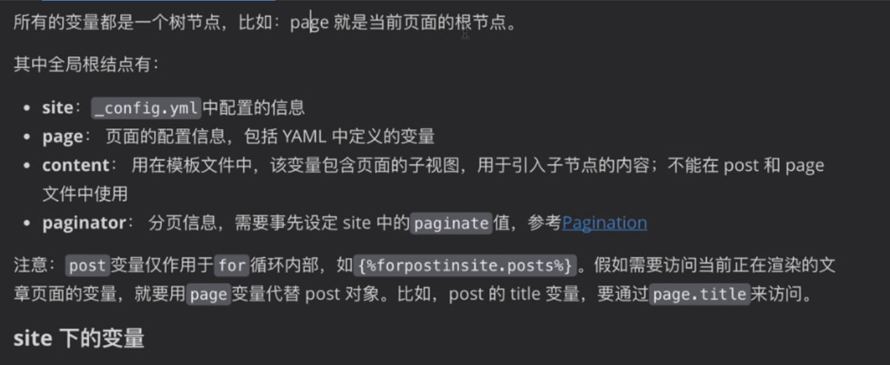

# 本地搭建博客

## 安装

* 安装ruby

在你的项目目录下,命令行中 依次执行

```shell
gem install jekyll

gem install jekyll bundler
```

以为项目安装环境

如果Gem安装不上或者很慢怎么办?

```shell
gem source --add https://gem.ruby-china.org/
--remove https://rubygems.org/
```

安装成功之后就可以创建站点了

```shell
jekyll new myblog
```

相当于创建myblog页面

进入myblog文件夹,然后安装页面的依赖(bundle install)

```shell
cd myblog
bundle install
```

此时已经可以访问我们的页面了

```shell
bundle exec jekyll serve
```

默认监听4000端口

访问该端口即可访问到主页面

>  打开jekyll为我们创建的项目查看目录结构
>
> 
>
> \_config.yml:jekyll站点的总配置文件,可以修改一些全局的配置(站点名称,作者名称等),注意他是个配置文件,存储的是键值对,可以在任意位置读取对应的值(修改了\_config,需要重启站点才能应用新配置)
>
> * description:站角的描述
>
> * baseurl:站点的子路径,当需要有二级路径的时候可以加上
>
> * plugins:添加的插件
>
> _posts:博客内容所在目录,里面要存放着本页面的博客文件(文件名称必须是yyy-mm-dd-文件名的格式),这里面的Markdown文件可以动态更新到网页
>
> 此外其实还可以有一个\_drafts目录用于保存我们博客的草稿,当完成对草稿的编写,将\_drafts文件夹中的文件拖入\_posts中发布即可
>
> \_site:目录用于存储jekll编译项目之后生成的源代码(类似于Java里面的class文件),我们访问的站点其实就是这个目录
>
> Gemfile:ruby用来依赖控制的文件,相当与maven中的pom.xm文件
>
> Gemfile.lock:依赖的版本控制

## 使用第三方主题快速搭建博客

在github上找到一个三方主题


clone项目到本地

用编辑器打开查看目录结构


> _include目录:可以理解为模板提供的代码片段,相当于整个博客页面中的小挂件(里面全是供我们使用的页面骨架),我们在使用的时候直接将这个文件夹的东西拿到我们自己的博客站点中即可
>
> _sass目录:样式表文件(.config.yml文件中会有如下配置将其转换为css样式)
> 

在这个三方项目中打开命令行安装项目的环境


```shell
bundle install
```

如何查看需要哪些依赖呢?

Gemfile文件中和_config.yml文件中的plugin中有体现

Gemfile中的插件是引入进项目的,_config.yml文件中的plugin是真正使用的插件

出现以下错误


需要安装对应的ruby和bundle版本

可以使用[rbenv](https://github.com/ccmywish/rbenv-for-windows)版本管理工具对ruby版本进行管理,安装合适的 ruby版本(这里我安装的是2.4.9-1),然后在安装bundle 1.16.0

```shell
gem install bundler -v 1.16.0
```

然后在项目下在执行`bundle install`(此时不要重复执行`gem install jekyll`因为第三方项目中的Gemfile文件会做这件事情) 在执行下面命令启动站点服务

```
bundle exec jekyll serve
```

# github pages 远程博客搭建

首先需要创建github账号

然后按照[githubpages](https://pages.github.com/)提示创建仓库(网上教程很多,这里不多说)

说一下

## 绑定自己的域名

首先需要一个域名

然后再域名提供商的DNS setting中将所申请的域名与username.gihub.io绑定


在github仓库设置页面中设置Custom domain


# 插件推荐

## SEO友好化

如果我们需要我们的博客能被搜索引擎更好的检索到,这时我们需要SEO友好化

利用插件 加一些 metadata标签 放入keyword 方便搜索引擎检索

[SEO插件](https://github.com/jekyll/jekyll-seo-tag/blob/master/docs/installation.md)

# 模板修改

在项目目录的_includes目录下有许多组件,这些组件可以再别处使用模板引擎被引用


具体使用方法是使用模板引擎语法引用进来


> _layouts目录下全是模板文件,模板文件是用来装饰页面的

_config文件里面定义的都是全局变量,在所有地方都可以引用


>  `site.baseurl`,site代表整个站点,他能读到\_config文件和\_data目录下的文件信息
>
> 除了site.xxx 还有page.xxx page表示当前页面(当前文章)

使用模板文件


在需要使用的第方加入上面的对应模板文件即可

_post文件夹下的文章名称需要以特定的格式开头

在jekyll解析之后会生成对应的html,而我们可以更改生成html的规则


## 文章结构


开始的

```
---
layout:post
title:'xxx'
cover_img: '/'
---
```

头部用于指定模板的变量,描述的信息,标签及其分类

如果更改头部格式,相应的layouts里面的post模板文件也要做对应的改变


## 变量




## liquid语法


具体过滤器的作用可以查看官方文档