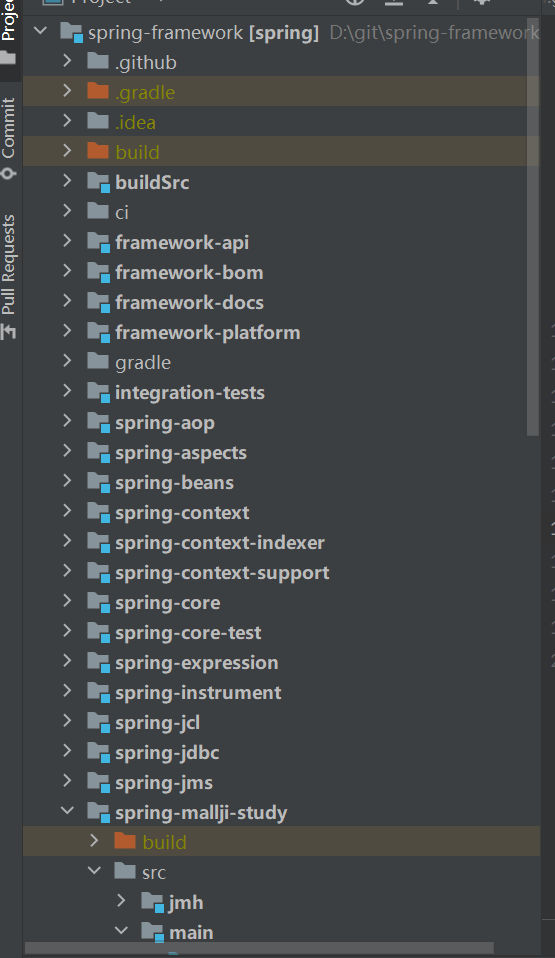
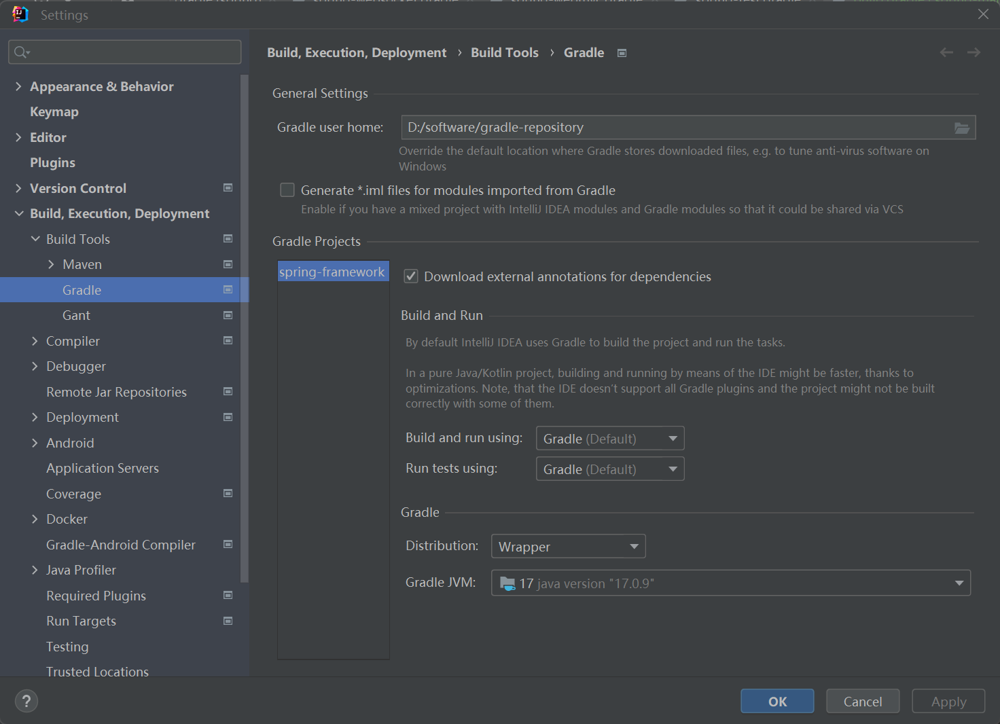
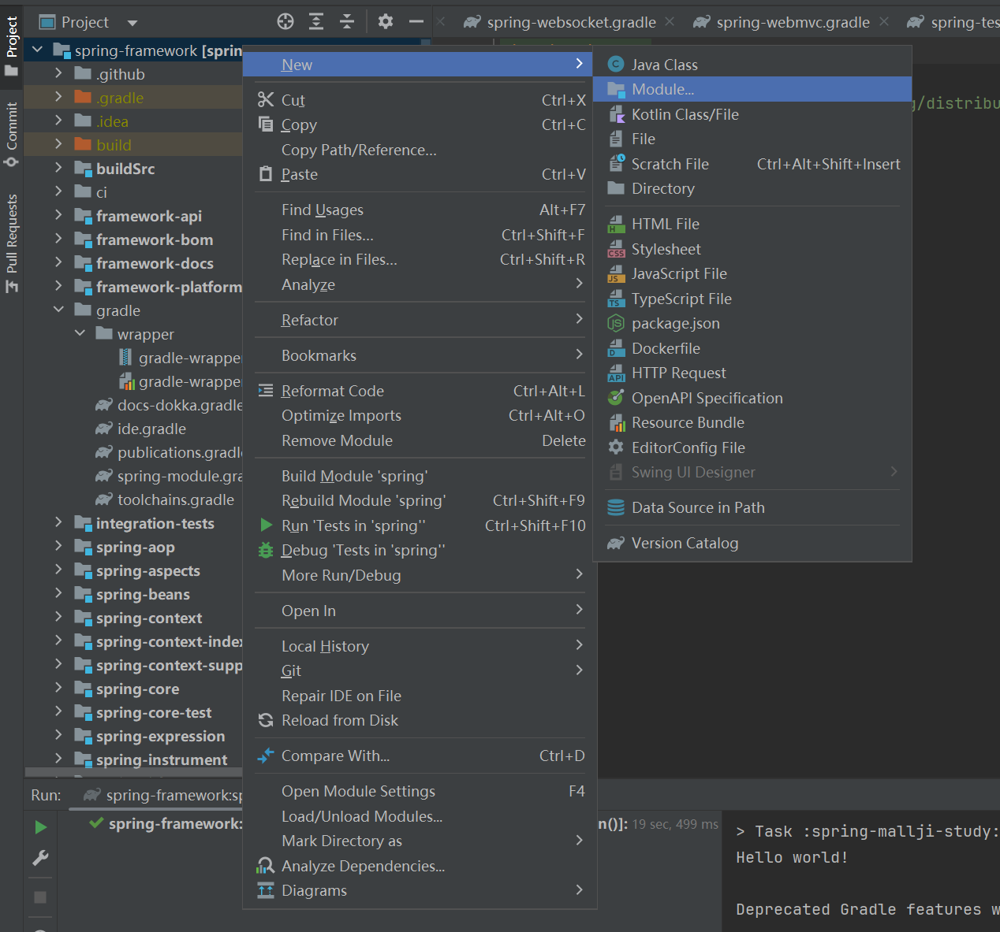
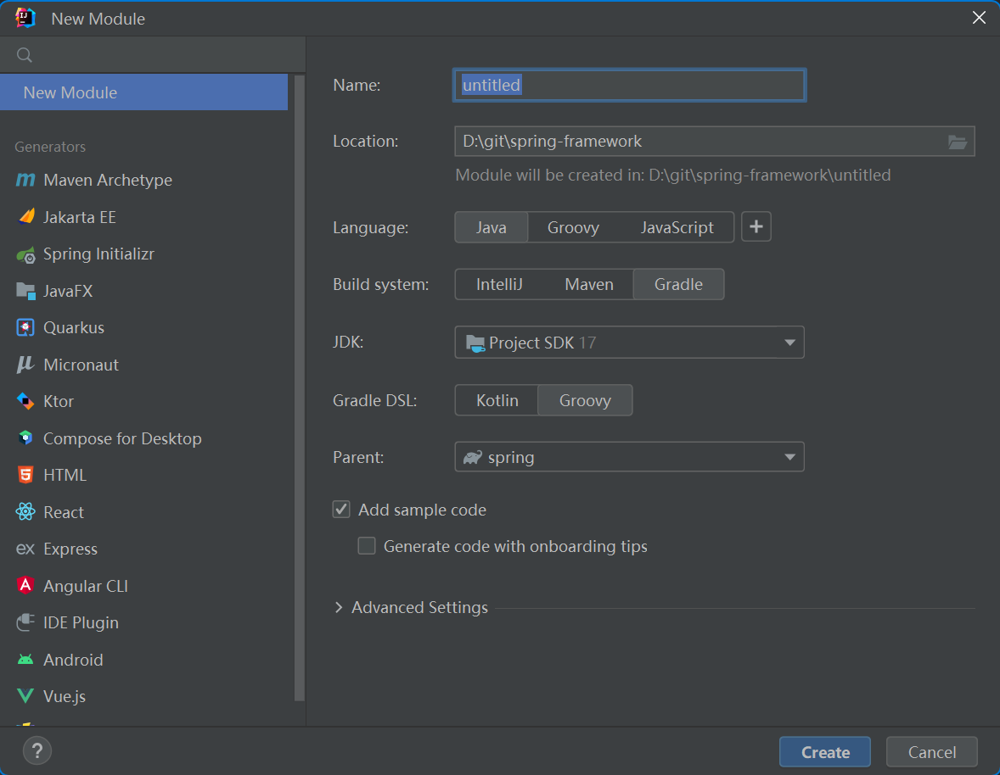
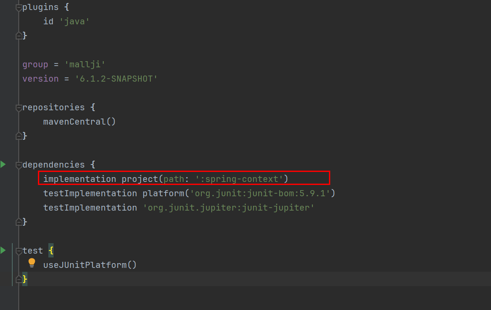

> 报错:java.nio.file.InvalidPathException: Illegal char <>> [in thread "Connection worker"]
>
> 这个错误通常是由于在导入Spring源码时文件路径存在问题引起的。`InvalidPathException` 表示路径非法，可能包含了不允许在文件路径中使用的字符。
>
> 出现这个错误的原因是IDEA破解的时候引入破解jar包ja-netfilter.jar的时候由于这个包在中文目录下导致的
>
> 解决办法:重装idea并按照如下步骤来安装,并且不能出现中文目录

在 `idea64.exe.vmoptions` 配置文件结尾添加如下配置：

```
# 引用补丁，开头必须以 -javaagent: 开头，后面跟着补丁的绝对路径（可根据你实际的位置进行修改）,注意路径一定要填写正确，且不能包含中文，否则会导致 IDEA 无法启动
-javaagent:D:/ja-netfilter/ja-netfilter.jar

# 最新 IDEA 版本需要添加下面两行，以支持 Java 17, 否则会报 Key is invalid
--add-opens=java.base/jdk.internal.org.objectweb.asm=ALL-UNNAMED
--add-opens=java.base/jdk.internal.org.objectweb.asm.tree=ALL-UNNAMED
```


打开spring源码工程之后 idea会自动进行下载依赖,下载完成之后所有的子模块都会被标记,如下图



项目中的gradle文件夹是Gradle Wrapper

我们推荐使用 `Gradle Wrapper` 执行`gradle` 构建，（后面简称`Wrapper`）.`Wrapper` 实质上是一个脚本，这个脚本使用申明版本的`gradle` 执行构建任务。如果本地没有`Wrapper` 中申明的`gradle` 版本，`Wrapper`会先下载它。这样开发者不必必须下载和项目指定版本相同的`gradle`，就可以完成构建。从而为公司节约时间、节约成本。

- `Wrapper` 仅仅是一个执行`gradle` 的脚本 。
- `Wrapper`只是为了让我们更方便快捷的使用 `gradle`。

idea中配置gradle



Distribution选择Wrapper,因为在spring的源码项目中的gradle中的wrapper中已经指定了gradle的版本,所以选择Wrapper,这样idea会在指定的Gradle user home文件夹下,下载了对应的gradle版本环境

Gradle user home 指定了依赖包的位置.这里选择本地的专门用于存储jar包依赖的仓库.

gradle会将依赖下载到Gradle user home的caches\modules-2下


# 在Spring源码中创建自己的项目



选择如下



在所创建的build.gradle文件中加入对spring-context的依赖



也可以让IDEA自动添加依赖(在类文件中写入对应的spring中的类名,然后使用alt+回车 快捷添加依赖)