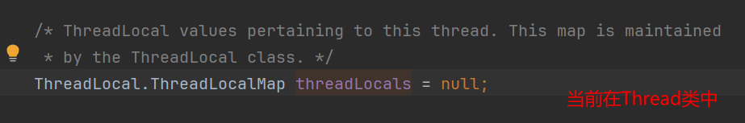

# 线程特有对象

当多个线程需要访问一个非线程安全的对象的时候,往往需要用到锁来保证访问的安全.其实我们可以通过创建线程的特有对象,使得每个线程都有一个仅供自己使用的私有对象,来解决锁带来的性能消耗.这样的一个对象只能被一个特定的线程访问到,我们称这样的对象叫做线程特有对象(TSO,Thread Specific Object),对应的线程叫做持有线程.

锁和线程特有对象是实现共享资源 访问安全的两种不同实现策略,线程特有对象是通过使用创建副本的方式来实现对共享资源的访问.

> 我产生的疑问:既然用到了线程特有对象,那另一种解决办法是不是可以把这个对象设置成一个该线程的成员变量呢?
>
> 请注意不要混淆线程类的成员变量和线程特有对象的概念.
> 在我理解看来,线程类的成员变量在创建对应的线程的时候就会初始化好.但是线程特有对象是要等到线程使用到这个特有对象的时候才会分配.一般来说线程特有的对象都设置成静态的,让其属于类.
>
> 虽然设置成线程类的特有对象可以有类似ThreaLocal的效果,但是使用TreadLocal有一下优点
>
> 1. **封装性**：`ThreadLocal` 提供了一种更好的封装方式，使得线程内的对象不需要暴露给线程类之外的代码。这对于库的设计者来说尤其重要，因为他们可以隐藏实现细节，而不必要求用户将特定的对象传递到每个线程。
> 2. **继承性**：`InheritableThreadLocal` 类提供了一种方法，可以让子线程从创建它的父线程中继承值。这在某些需要保持父线程和子线程之间某种状态共享的场景下非常有用。
> 3. **与线程池的兼容性**：在使用线程池时，线程是被重用的，因此不能将状态作为线程的成员变量存储，因为这个状态可能会在任务之间共享。`ThreadLocal` 可以确保即使在线程被重用的情况下，每个任务也可以有自己的线程特有对象。
> 4. **减少同步需求**：由于 `ThreadLocal` 中的数据是线程隔离的，因此不需要额外的同步措施，这可以减少线程间的竞争，从而提高性能。(如果我设置成成员变量,那么别的线程还是可以通过该线程对象来访问到该线程的这个成员变量,似乎不太安全)
> 5. **全局变量访问**：有时候你可能需要在应用程序的不同部分访问某个应该是线程隔离的全局变量。`ThreadLocal` 提供了一种方式来保持这种全局访问，同时又保持了线程隔离性。
>
> 然而，使用 `ThreadLocal` 也有一些缺点，比如内存泄漏的风险（如果没有正确清理），以及对垃圾收集器的额外负担。因此，在决定使用 `ThreadLocal` 还是线程的成员变量时，应该根据具体的使用场景和需求来做出选择。如果你的线程生命周期管理得当，而且线程中需要使用的状态不需要跨方法或跨线程池任务传递，那么使用线程的成员变量是一个简单有效的选择。
>
> 使用TreadLocal减少了代码的耦合

## ThreadLocal<T>类

ThradLocal是Java实现线程特有对象的一种解决方案,ThreadLocal对像相当于一个代理对象,用于代理线程来访问该线程的特有对象

如图所示:


常用方法:


### ThreadLocal具体实现

* 每个线程（Thread实例）内部会维护一个类似HashMap的对象，我们称之为ThreadLocalMap。

* ThreadLocalMap内部会包含若干Entry（条目，一个键Key-值Value对）

* 相应的线程就被称为这些条目的属主线程

* Entry的Key是一个ThreadLocal实例(的弱引用)，Value是一个线程特有对象。

* Entry的作用相当于为其属主线程建立起一个ThreadLocal实例与一个线程特有对象之间的对应关系。

* Entry对ThreadLocal实例的引用（通过Key引用）是一个弱引用（Weak Reference），因此它不会阻止被引用的ThreadLocal实例被垃圾回收.

* 当一个ThreadLocal实例没有对其可达的（Reachable）强引用时，这个实例可以被垃圾回收，即其所在的Entry的Key会被置为null。此时，相应的Entry就成为无效条目 （Stale Entry）。

* 另一方面，由于Entry对线程特有对象的引用是强引用，因此如果无效条目本身有对它的可达强引用，那么无效条目也会阻止其引用的线程特有对象被垃圾回收。

* 当ThreadLocalMap中有新的ThreadLocal到线程特有对象的映射（对应）关系被创建（相当于有新的Entry被添加到ThreadLocalMap）的时候，ThreadLocalMap会将无效条目清理掉 [5]  ，这打破了无效条目对线程特有对象的强引用，从而使相应的线程特有对象能够被垃圾回收。

> 缺点
> 但是，这个处理也有一个缺点——一个线程访问过线程局部变量之后如果该线程有对其可达的强引用，并且**该线程在相当长时间内（甚至一直）处于非运行状态**，那么该线程的ThreadLocalMap可能就不会有任何变化，因此相应的ThreadLocalMap中的无效条目也不会被清理，这就可能导致这些线程的各个Entry所引用的线程特有对象都无法被垃圾回收，即导致了伪内存泄漏。

具体结构如下


get方法源码

```java
    /**
     * Returns the value in the current thread's copy of this
     * thread-local variable.  If the variable has no value for the
     * current thread, it is first initialized to the value returned
     * by an invocation of the {@link #initialValue} method.
     *
     * @return the current thread's value of this thread-local
     */
    public T get() {
        Thread t = Thread.currentThread();
        ThreadLocalMap map = getMap(t);
        if (map != null) {
            ThreadLocalMap.Entry e = map.getEntry(this);
            if (e != null) {
                @SuppressWarnings("unchecked")
                T result = (T)e.value;
                return result;
            }
        }
        return setInitialValue();
    }
```

先取到当前线程，然后调用getMap方法获取对应的ThreadLocalMap，ThreadLocalMap是一个声明在ThreadLocal的静态内部类，然后在**Thread类**中有一个这样类型成员变量，该成员变量的实例化是在ThreadLocal的createMap方法中,所以getMap是直接返回Thread的这个成员变量。

查看源码可知ThreaLocalMap是通过Map来存储元素的,内部有一个Entry数组,用来存放变量的副本





createMap方法使线程特有对象与ThreadLocal对象建立联系(返回一个对应的ThreadLocalMap对象)

在以下两个方法中会使用到


即在我们调用ThreadLocal对象的set方法的时候会将当前线程特有对象与threadLocal,而ThreadLocalMap又是当前Thread对象的成员变量

所以具体结构如下


set方法源码


```java

    /**
     * Sets the current thread's copy of this thread-local variable
     * to the specified value.  Most subclasses will have no need to
     * override this method, relying solely on the {@link #initialValue}
     * method to set the values of thread-locals.
     *
     * @param value the value to be stored in the current thread's copy of
     *        this thread-local.
     */
    public void set(T value) {
        Thread t = Thread.currentThread();
        ThreadLocalMap map = getMap(t);
        if (map != null) {
            map.set(this, value);
        } else {
            createMap(t, value);
        }
    }
```

